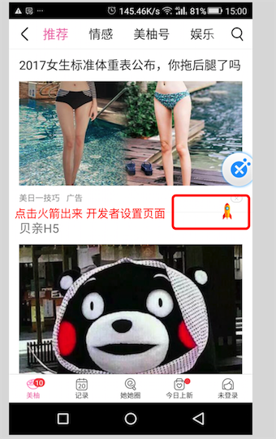

# Developer
开发者功能，
- 所有页面简单初始化后，都可以调用开发者页面功能；
- 同时每个页面，也可以配置自己的测试功能；
- 集成了二维码扫描；
- 应用清除缓存；
- 卸载应用；
- 使用帮助

### Relation ;
-  [Rocket] http://git.meiyou.im/Android/rocket
-  [QrCode] (http://git.meiyou.im/Android/QrcodeMain)
- [开发者页面](http://git.meiyou.im/Android/Android/wikis/%E5%BC%80%E5%8F%91%E8%80%85%E9%A1%B5%E9%9D%A2)



### build 

```groovy
//编译
compile 'com.meiyou.framework:developer:1.0.0-SNAPSHOT'
// 经期 只在测试，预发阶段引入；
//compile 'com.meiyou.framework:developer-noop:1.0.0-SNAPSHOT'
```

### 使用

#### Activity 配置，启动悬浮窗 

你可以初始化在 具体的 activity里面 或者在BaseActivity,这样每个页面都可以用；

```java
@Override protected void onCreate(Bundle savedInstanceState) {
    ...

    Rocket.init(this)
      .inject(AppRocketConfig.class);  //required
}
```

### AppRocketConfig  参考 Rocket使用
```java
public class DeveloperConfig extends RocketConfig {
    
    @Button("点击发起APM接口和Batch接口")
    public void doBatch() {
        //轮询接口，为了方便测试，自己点击发起
        ApmSyncManager.getInstance().doSync(context);
        GaSyncManager.getInstance().doSync(context);
    }

    @EditText("输入Uri，如：meiyou:///news/comment/open")
    public void doUri(String uri) {
        MeetyouDilutions.create().formatProtocolService(uri);
    }

    /**
     * 临时方法测试
     */
    @Button("临时方法测试")
    public void temp() {
//        RuntimeUtil.uninstall(this);
//        RefreshAuthController.getInstance().handle(context, true);

    }

    public void testLogin() {
        LoginConfig config = new LoginConfig();
        config.bEnterMain = false;
        LoginActivity.enterActivity(context, config, null);
    }

    @Title("QaTest 功能(Charles查看埋点数据)")
    @CheckBox
    public void openQaTest(boolean enable) {
        ToastUtils.showToast(context, "Qa Test 功能启用状态：" + enable);

        QaTestConfig config = new QaTestConfig();
        config.enable = enable;
        QaTestController.getInstance().setConfig(config);

        SharedPreferencesUtil.saveBoolean(context, DeveloperController.key_qatest, enable);
    }

    @Button("清除联合登录数据")
    public void clearUnionLogin() {
        if (AppTraveler.getInstance().clearAccount()) {
            ToastUtils.showToast(context, "清除联合账号数据成功");
        } else {
            ToastUtils.showToast(context, "清除联合账号数据失败");
        }
    }
```


